# CIS-School-Work
Repository for storing some of my school coding works.

### Table of Contents

------------

------------

## CIS 199
#### Lab1 - Simple WriteLine Program (Console)
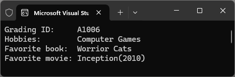
```csharp
static void Main(string[] args)
        {
            WriteLine("Grading ID:     A1006");
            WriteLine("Hobbies:        Computer Games");
            WriteLine("Favorite book:  Worrior Cats");
            WriteLine("Favorite movie: Inception(2010)");
        }
```


#### Lab2 - Tip Calculator (Form)
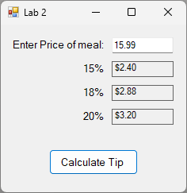
```csharp
private void calcTipBtn_Click(object sender, EventArgs e)
{
    double mealPrice, tip15, tip18, tip20;
    try
    {
        mealPrice = double.Parse(priceInputBox.Text);
        tip15 = mealPrice * 0.15;
        tip18 = mealPrice * 0.18;
        tip20 = mealPrice * 0.20;
        tipAmount15.Text = tip15.ToString("C2", CultureInfo.GetCultureInfo("en-US"));
        tipAmount18.Text = tip18.ToString("C2", CultureInfo.GetCultureInfo("en-US"));
        tipAmount20.Text = tip20.ToString("C2", CultureInfo.GetCultureInfo("en-US"));
    }
    catch (System.FormatException)
    {
        tipAmount15.Text = "INVALID";
        tipAmount18.Text = "INVALID";
        tipAmount20.Text = "INVALID";
    }
}
```

#### Lab3 - Sphere Calculator (Form)
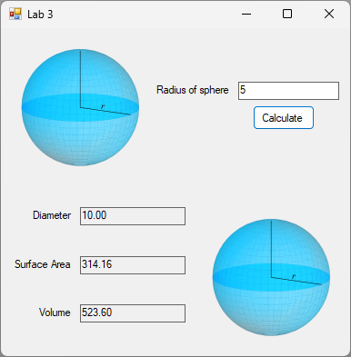
```csharp
private void calculate_Click(object sender, EventArgs e)
{
    double radius, rSquared,  rCubed, diameter, surfaceArea, volume, PI;
    try
    {
        radius = double.Parse(radiusBox.Text);
        PI = Math.PI;
        rSquared = Math.Pow(radius, 2);
        rCubed = Math.Pow(radius, 3);
        diameter = radius * 2;
        surfaceArea = 4 * PI * rSquared;
        volume = (4 * PI * rCubed) / 3;

        diameterBox.Text = diameter.ToString("N2");
        surfaceAreaBox.Text = surfaceArea.ToString("N2");
        volumeBox.Text = volume.ToString("N2");
    }
    catch (FormatException)
    {
        diameterBox.Text = "INVALID";
        surfaceAreaBox.Text = "INVALID";
        volumeBox.Text = "INVALID";
    }
}
```

#### Lab4 - Admission Calculator (Form)
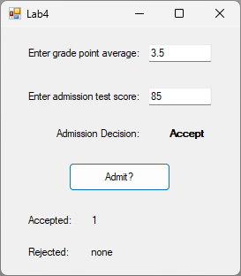
```csharp
private void admitBtn_Click(object sender, EventArgs e)
{
    double gpa, ats;

    if (double.TryParse(gpaBox.Text, out gpa) && double.TryParse(admissionTestScoreBox.Text, out ats))
    {
        if (gpa >= 0.0 && gpa <= 4.0 && ats >= 0 && ats <= 100)
        {
            if (gpa >= 3.0 && ats >= 60)
            {
                admissionDecision.Text = "Accept";
                accepted++;
                acceptedCount.Text = accepted.ToString();
            }
            else if (gpa < 3.0 && ats >= 80)
            {
                admissionDecision.Text = "Accept";
                accepted++;
                acceptedCount.Text = accepted.ToString();
            }
            else
            {
                admissionDecision.Text = "Reject";
                rejected++;
                rejectedCount.Text = rejected.ToString();
            }
        }
        else {MessageBox.Show("Check your numbers!");}
    }
    else {MessageBox.Show("Check your numbers!");}
}
```


#### Lab5 - Mean Temperature Calculator (Console)
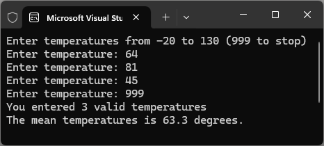
```csharp
static void Main(string[] args)
{
    bool parseResult;
    double totalTemp = 0, meanTemp = 0, input;
    int loopCount = 0;
    const int minTemp = -20, maxTemp = 130, exitCode = 999;

    Console.WriteLine("Enter temperatures from -20 to 130 (999 to stop)");
    Console.Write("Enter temperature: ");
    parseResult = (double.TryParse(Console.ReadLine(), out input)) && (input >= minTemp && input <= maxTemp);

    while (input != exitCode) 
    { 
        if (parseResult)
        {
            totalTemp = totalTemp + input;
            ++loopCount;
        }
        else
        {
            Console.WriteLine("Valid temperatures range from -20 to 130. Please reenter temperature.");
        }
        Console.Write("Enter temperature: ");
        parseResult = (double.TryParse(Console.ReadLine(), out input)) && (input >= minTemp && input <= maxTemp);
    )
    meanTemp = totalTemp / loopCount;
    Console.WriteLine($"You entered {loopCount} valid temperatures");
    Console.WriteLine($"The mean temperatures is {meanTemp.ToString("F1")} degrees.");
}
```


#### Lab6 - Star Pattern Generator (Console)
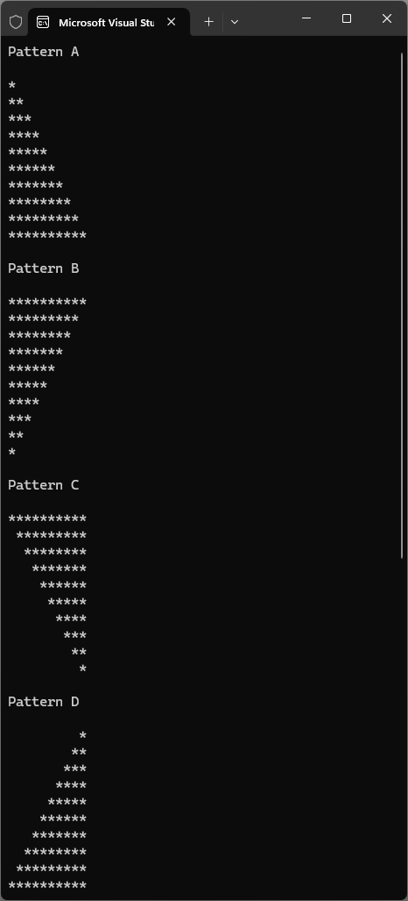
```csharp
static void Main(string[] args)
{
    const int maxRow = 10;
    const int minRow = 1;

    Console.WriteLine("Pattern A");
    Console.WriteLine();

    for (int row = 1; row <= maxRow; row++)
    {
        for (int star = 0; star < row; ++star)
        {
            Console.Write("*");
        }
        Console.WriteLine();
    }

    Console.WriteLine();
    Console.WriteLine("Pattern B");
    Console.WriteLine();

    for (int row = 10; row >= minRow; row--)
    {
        for (int star = 0; star < row; ++star)
        {
            Console.Write("*");
        }
        Console.WriteLine();
    }

    Console.WriteLine();
    Console.WriteLine("Pattern C");
    Console.WriteLine();

    for (int row = 10; row >= minRow; row--)
    {
        int reverseRow = (10 - row);
        for (int space = 0; space < reverseRow; ++space)
        {
            Console.Write(" ");
        }
        for (int star = 0; star < row; ++star)
        {
            Console.Write("*");
        }
        Console.WriteLine();
    }

    Console.WriteLine();
    Console.WriteLine("Pattern D");
    Console.WriteLine();

    for (int row = 1; row <= maxRow; row++)
    {
        int reverseRow = (10 - row);
        for (int space = 0; space < reverseRow; ++space)
        {
            Console.Write(" ");
        }
        for (int star = 0; star < row; ++star)
        {
            Console.Write("*");
        }
        Console.WriteLine();
    }
    Console.WriteLine();
}

```

#### Lab7 - Star Cube Generator (Console)
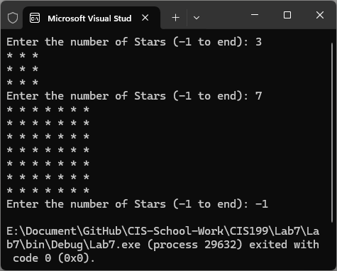
```csharp
static void Main(string[] args) 
{
    int input = 0;
    bool parse = false;

    while (input != -1)
    {
        Console.Write("Enter the number of Stars (-1 to end): ");
        parse = int.TryParse(Console.ReadLine(), out input);

        if (parse && input > 0)
        {
            ShowSquareOfStars(input);
        }
        else
        {
            if (input == -1)                    
                break;
            else
                Console.WriteLine("Enter Valid Positive number.");
        }
    }
}

static void ShowSquareOfStars(int numStars)
{
    for (int i = 0; i < numStars; i++) 
    {
        for (int j = 0; j < numStars; j++) 
        {
            Console.Write("* ");
        }
        Console.WriteLine();
    }
}
```

#### Program1 - Mural Calculator (Form)
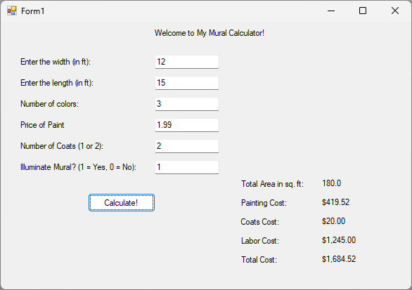
```csharp
private void button1_Click(object sender, EventArgs e)
{
    double width, length, price, paintingArea, laborCost, paintCost, coatingCost, totalCost;
    int colors, coats, illuminate;

    const double wastePercentage = 0.1;
    const double colorCost = 8.5;
    const double coatCost = 10;
    const double illuminateCost = 75;
    const double laborFeeSqFt = 6.5;

    try
    {
        width = double.Parse(widthBox.Text);
        length = double.Parse(lengthBox.Text);
        price = double.Parse(paintPriceBox.Text);
        colors = int.Parse(colorsBox.Text);
        coats = int.Parse(coatsBox.Text);
        illuminate = int.Parse(illuminateBox.Text);

        paintingArea = width * length;
        laborCost = (illuminate * illuminateCost) + (paintingArea * laborFeeSqFt);
        paintCost = (paintingArea * price) * (1 + wastePercentage) + (colors * colorCost);
        coatingCost = coats * coatCost;
        totalCost = laborCost + paintCost + coatingCost;

        totalAreaLbl.Text = paintingArea.ToString("F1");
        paintCostLbl.Text = paintCost.ToString("C2");
        coatsCostLbl.Text = coatingCost.ToString("C2");
        laborCostLbl.Text = laborCost.ToString("C2");
        totalCostLbl.Text = totalCost.ToString("C2");
    }
    catch (FormatException)
    {
        totalAreaLbl.Text = "Invalid";
        paintCostLbl.Text = "Invalid";
        coatsCostLbl.Text = "Invalid";
        laborCostLbl.Text = "Invalid";
        totalCostLbl.Text = "Invalid";
    }
}

```

#### Program2 - Insurance Policy Calculator (Form)
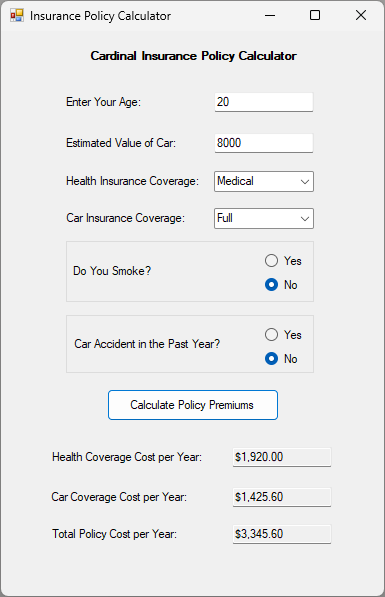
```csharp
public partial class Form1 : Form
{
    public Form1()
    {
        InitializeComponent();
        string[] healthInsurance = { "Medical", "Dental", "Vision", "None" };
        string[] carInsurance = { "Full", "Liability", "None" };
        healthInsuranceCombo.Items.AddRange(healthInsurance);
        carInsuranceCombo.Items.AddRange(carInsurance);
    }

    private void Form1_Load(object sender, EventArgs e)
    {

    }

    private void calculateBtn_Click(object sender, EventArgs e)
    {
        int age, carValue;
        double totalCost, carCoverageCost, carCoverageCost2, carCoverageCostAnnual, carBaseRate, healthCoverageCost, healthCoverageCostAnnual, medicalRate = 0, dentalRate = 0, visionRate = 0, fullRate = 0, liabilityRate = 0, smokeRate = 0, youngRate = 0, baseRateDecrease = 0, baseRateIncrease = 0;
        bool ageParse, carValueParse, goodState, ageCheck, valueCheck, healthCheck, carCheck, smokeCheck, accidentCheck;

        ageParse = int.TryParse(ageBox.Text, out age);
        carValueParse = int.TryParse(valueBox.Text, out carValue);

        try
        {
            if (!ageParse || age < 1 || age > 100)
            {
                MessageBox.Show("Invalid Age");
                ageCheck = false;
            }
            else ageCheck = true;

            if (!carValueParse || carValue < 0)
            {
                MessageBox.Show("Invalid Car Value");
                valueCheck = false;
            }
            else valueCheck = true;

            if (healthInsuranceCombo.SelectedIndex == -1) healthCheck = false;
            else healthCheck = true;

            if (carInsuranceCombo.SelectedIndex == -1) carCheck = false;
            else carCheck = true;

            if (!smokeYes.Checked && !smokeNo.Checked)
            {
                MessageBox.Show("Missing Smoking Status");
                smokeCheck = false;
            }
            else smokeCheck = true;

            if (!accidentYes.Checked && !accidentNo.Checked)
            {
                MessageBox.Show("Missing Accident History");
                accidentCheck = false;
            }
            else accidentCheck = true;

            if (ageParse && carValueParse && ageCheck && valueCheck && healthCheck && carCheck && smokeCheck && accidentCheck)
                goodState = true;
            else goodState = false;

            if (healthInsuranceCombo.SelectedItem.ToString() == "Medical" && goodState)
            {
                medicalRate = 160;
                if (smokeYes.Checked)
                    smokeRate = 70;
            }

            if (healthInsuranceCombo.SelectedItem.ToString() == "Dental" && goodState)
                dentalRate = 20;

            if (healthInsuranceCombo.SelectedItem.ToString() == "Vision" && goodState)
                visionRate = 30;

            if (carInsuranceCombo.SelectedItem.ToString() == "Full" && goodState)
            {
                fullRate = 110;
                if (age <= 21)
                    youngRate = 25;
                if (carValue < 15000)
                    baseRateDecrease = 0.12;
                if (accidentYes.Checked)
                    baseRateIncrease = 0.2;
            }

            if (carInsuranceCombo.SelectedItem.ToString() == "Liability" && goodState)
            {
                liabilityRate = 50;
                if (age <= 21)
                    youngRate = 25;
                if (carValue < 15000)
                    baseRateDecrease = 0.12;
                if (accidentYes.Checked)
                    baseRateIncrease = 0.2;
            }

            healthCoverageCost = medicalRate + dentalRate + visionRate + smokeRate;
            carBaseRate = youngRate + fullRate + liabilityRate;
            carCoverageCost = carBaseRate - (carBaseRate * baseRateDecrease);
            carCoverageCost2 = carCoverageCost + (carCoverageCost * baseRateIncrease);
            healthCoverageCostAnnual = healthCoverageCost * 12;
            carCoverageCostAnnual = carCoverageCost2 * 12;
            totalCost = healthCoverageCostAnnual + carCoverageCostAnnual;

            healthCostBox.Text = healthCoverageCostAnnual.ToString("C2");
            carCostBox.Text = carCoverageCostAnnual.ToString("C2");
            totalCostBox.Text = totalCost.ToString("C2");
        }
        catch (System.NullReferenceException)
        {
            MessageBox.Show("Please Select your Insurance Coverage!");
        }
    }
}

```

#### Program3 - Contract Length Calculator (Form)
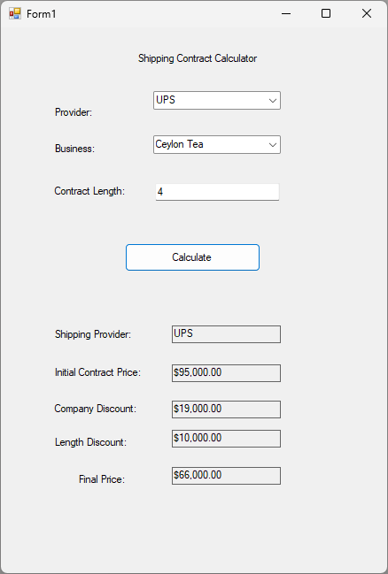
```csharp
public partial class Form1 : Form
{
    double[] discountRate = { 0.22, 0.18, 0.19, 0.20 };
    string[] company = { "USPS", "DHL", "FedEx", "UPS" };
    string[] business = { "John's Books", "Office Supplies", "J.B. Car Parts", "Gevalia Coffee", "Ceylon Tea", "My Footwear" };
    double[] contractPrice = { 55000, 85000, 60000, 75000, 95000, 55000 };
    int[,] contractYears = { { 0, 0, 1 }, {2, 3, 4 }, {5, 6, 7 }, {8, 9, 10 } };
    double[] addDiscount = { 0, 10000, 20000, 30000 };

    public Form1()
    {
        InitializeComponent(); 
        providerComBox.Items.AddRange(company);
        businessComBox.Items.AddRange(business);
    }

    public void calculateBtn_Click(object sender, EventArgs e)
    {
        bool providerCheck, businessCheck, contractCheck, loop = true;

        int contractLength, providerIndex = 0, businessIndex = 0, contractIndex = 0, rows = contractYears.GetLength(0), cols = contractYears.GetLength(1);

        double companyDiscount, finalPrice;

        try
        {
            if (providerComBox.SelectedIndex == -1)
            {
                MessageBox.Show("You Must Select a Provider");
                providerCheck = false;
            }
            else providerCheck = true;

            if (businessComBox.SelectedIndex == -1)
            {
                MessageBox.Show("You Must Select a Business");
                businessCheck = false;
            }
            else businessCheck = true;

            contractCheck = int.TryParse(contractLengthBox.Text, out contractLength);       
            if (contractCheck == false)
                MessageBox.Show("You Must Provide Valid Contract Years [0,10]");

            else
            {
                if (contractLength >= 0 && contractLength <= 10)
                    contractCheck = true;

                else
                {
                    MessageBox.Show("You Must Provide Valid Contract Years [0,10]");
                    contractCheck = false;
                }
            }

            if (providerCheck == true && businessCheck == true && contractCheck == true)
            {
                for (int i = 0; i < company.Length; i++)
                {
                    if (providerComBox.Text == company[i].ToString())
                    {
                        providerIndex = i;
                        break;
                    }
                }

                for (int i = 0; i < business.Length; i++)
                {
                    if (businessComBox.Text == business[i].ToString())
                    {
                        businessIndex = i;
                        break;
                    }
                }

                while (loop)
                {
                    for (int i = 0; i < rows; i++)
                    {
                        for (int x = 0; x < cols; x++)
                        {
                            if (contractYears[i, x] == contractLength)
                            {
                                contractIndex = i;
                                loop = false;
                                break;
                            }
                        }
                        if (!loop) break;
                    }
                }

                providerBox.Text = company[providerIndex].ToString();
                initialContractBox.Text = contractPrice[businessIndex].ToString("C2");
                companyDiscount = contractPrice[businessIndex] * discountRate[providerIndex];
                companyDiscountBox.Text = companyDiscount.ToString("C2");
                lengthDiscountBox.Text = addDiscount[contractIndex].ToString("C2");
                finalPrice = contractPrice[businessIndex] - companyDiscount - addDiscount[contractIndex];
                finalPriceBox.Text = finalPrice.ToString("C2");
            }
        }
        catch (System.NullReferenceException) { MessageBox.Show("NullReferenceException"); }
    }
}

```

#### Exam1 - Membership Calculator (Form)
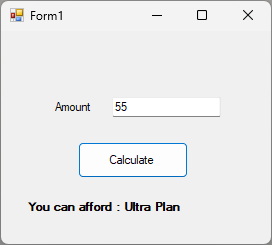
```csharp
private void calculateBtn_Click(object sender, EventArgs e)
{
    double input;
    bool result;

    result = double.TryParse(amountBox.Text, out input);

    if (result == true) 
    {
        if (input >= 61) 
        {
            outputLbl.Text = "You can afford : VIP Membership";
        }
        else if (input >= 46 && input <= 60)
        {
            outputLbl.Text = "You can afford : Ultra Plan";
        }
        else if (input >= 31 && input <= 45)
        {
            outputLbl.Text = "You can afford : Family Plan";
        }
        else if (input >= 21 && input <= 30)
        {
            outputLbl.Text = "You can afford : Premium Plan";
        }
        else if (input >= 11 && input <= 20)
        {
            outputLbl.Text = "You can afford : Standard Plan";
        }
        else if (input >= 5 && input <= 10)
        {
            outputLbl.Text = "You can afford : Basic Plan";
        }
        else
        {
            outputLbl.Text = "You cannot afford any plans!";
        }
    }
    else if (result == false)
    {
        outputLbl.Text = "Please Enter Valid Amount!";
    }
}

```
